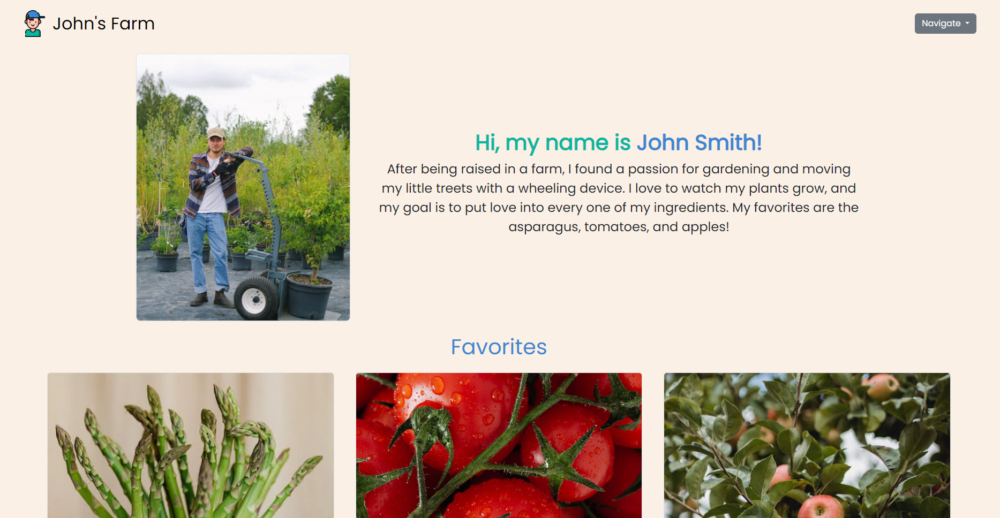
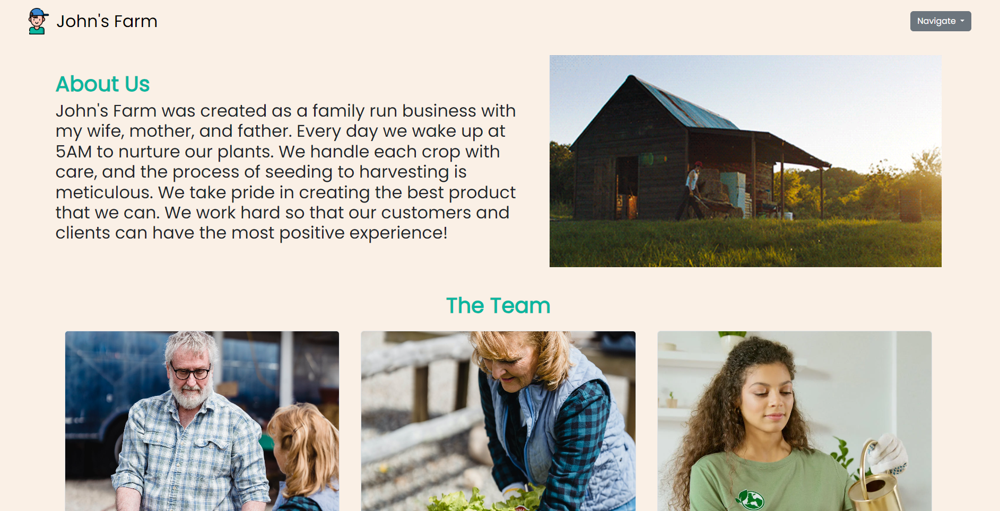

# John's Farm

John's Farm is a website that tells the story of John and his family. He talks about what motivates him and what he strives for as a farmer. In the home page, he mentions his favorite and in season crops. The site also allows for him to interact with his customers by providing them with the ability to sign up for communication and order crops. 

## Installation

John's Farm is created by multiple static HTML pages. To open the pages, you can download the files as a Zip and extract them. Once extracted you can double click them to open each page.

## Images 

### Home Page

### Schedule Page

### About Page

